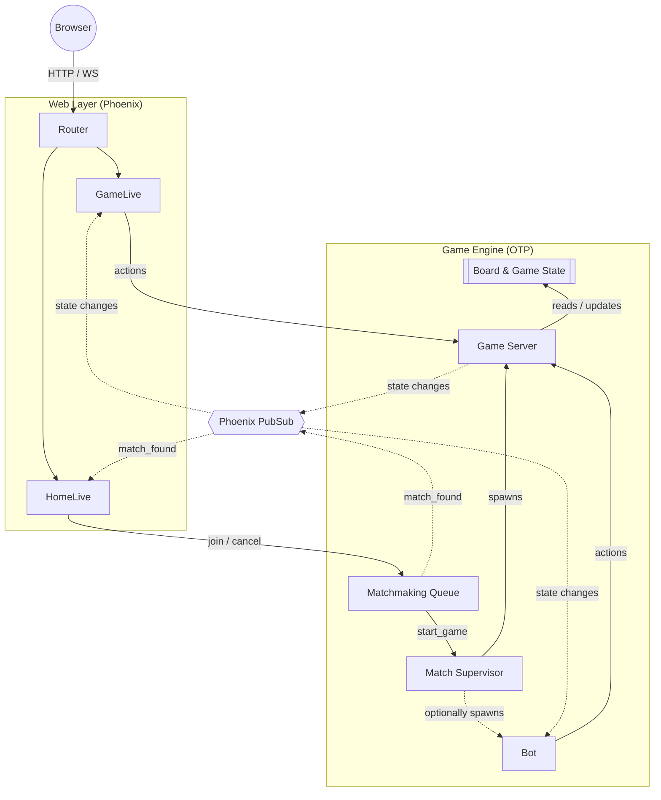

# Battleship
The original Battleship board game brought to a real-time web application on Elixir/OTP and Phoenix.

**Live Demo:** [battleship.ffutryk.com](https://battleship.ffutryk.com)

## Overview
A Battleship implementation built to learn Elixir and put my concurrency patterns into test through a real, playable product. Players are matched anonymously through a queue and play in isolated game processes.

## Key Features
- **No account required:** Guest sessions are issued automatically so that anyone can join and start a match.
- **Never stuck waiting for an opponent:** The matchmaking queue pairs live players and falls back to a bot match after a short timeout.
- **Fault-isolated matches:** Each match runs as its own supervised process tree so that one crashed match won't take the whole app down.
- **Real-time sync:** Shots, hovers, and phase transitions are pushed through PubSub and rendered directly by a LiveView.

## Architecture
The application uses Elixir's OTP to ensure high availability and process isolation.

- Game rules, board validation, and state transitions are handled by pure functional modules.
- The matchmaking is handled by a centralized `GenServer` that monitors connected players and triggers a fallback bot if no human opponent joins within 5 seconds.
- Each game runs in an isolated `GenServer` spawned by a `DynamicSupervisor` and overseen by a dedicated `MatchSupervisor` in case it has a `Bot` process.
- The game state is decoupled from the presentation layer through the `Phoenix.PubSub` module. The game process broadcasts events to the game topic which the `LiveView` listens to in order to update the UI in real-time. The Bot also subscribes to these topics to emulate a real client without adding coupling to the game logic.

## Setup
 
1. Install dependencies: `mix deps.get`
2. Bootstrap the app: `mix setup` (runs `deps.get`, `ecto.setup`, `assets.setup`, `assets.build`)
3. Start the server: `mix phx.server` or `iex -S mix phx.server`

Now you can visit [`localhost:4000`](http://localhost:4000) from your browser.

## Roadmap / TODO

- Improve UI user feedback (sounds, alerts, etc)
- Add persistent accounts beyond guest sessions
- Add a friends list and private matches
- Integrate skill-based matchmaking (ELO system) once accounts are added, and allow players to queue either on ranked mode that modifies their ELO/Stats or a casual mode that just matchmakes with other casual or guest players.

## License

Distributed under the [MIT](https://choosealicense.com/licenses/mit/) License. See the [LICENSE](./LICENSE) file for more information.
